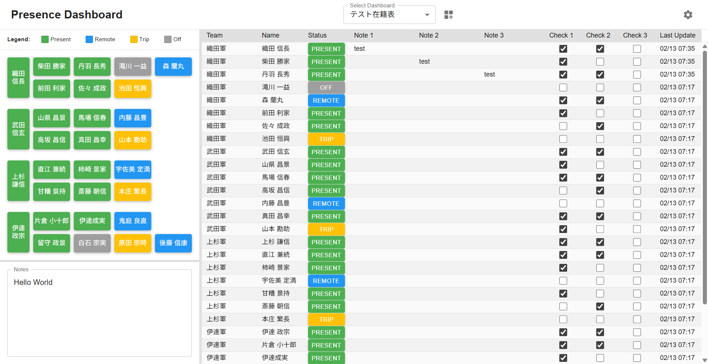
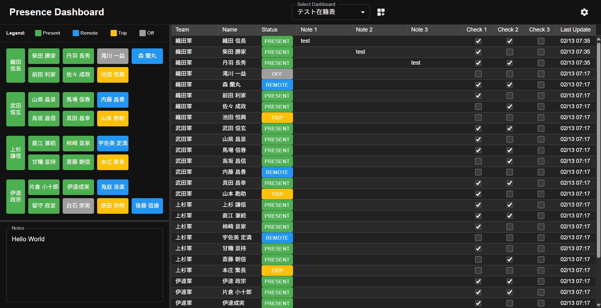
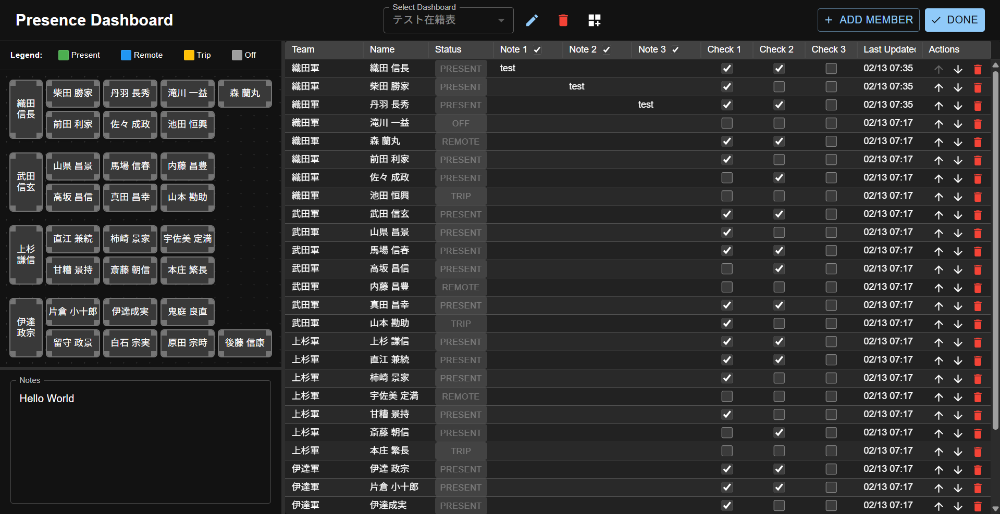

# Presence Dashboard
A dynamic, real-time presence management application with a full-stack architecture. Built with React, Material UI, and Express, this dashboard allows teams to visualize member status through both a grid-based list and a customizable 2D floor plan.  

## Features
- Dual View System: * Interactive Map: Drag-and-drop seating arrangement with a dot-grid background for precision.  
  - Data Grid: A robust table view powered by MUI X DataGrid for quick editing and sorting.  
- Presence Management: Toggle between `Present`, `Remote`, `Trip`, and `Off` with color-coded visual cues.  
- Multi-Dashboard Support: Create and manage multiple office layouts or team boards.  
- Dynamic Customization: * Setting Mode: Toggle to reposition seats, add/remove members, or reorder the list.  
  - Custom Labels: Rename column headers (e.g., "Note 1" to "Project") directly from the UI.  
- Real-time Synchronization: Auto-polls the backend every 10 seconds (when not in setting mode) to keep status updates fresh across all clients.  
- Theme Aware: Built-in support for Dark/Light mode based on system preferences.

## Screenshots
### Main View
<table>
  <tr>
    <td></td>
    <td></td>
  </tr>
  <tr>
    <td align="center"><em>Light Mode</em></td>
    <td align="center"><em>Dark Mode</em></td>
  </tr>
</table>
*The main dashboard showing the dual view system with interactive map and data grid*

### Setting Mode

*Setting mode with customization options for layout and settings*

## Tech Stack
### Frontend
- **Framework**: React (Vite)
- **UI Library**: Material UI (MUI)
- **Components**: 
  - `@mui/x-data-grid` for the tabular view
  - `react-draggable` for seat positioning
- **State Management**: React Hooks (useCallback, useMemo, useRef)
- **Icons**: MUI Icons

### Backend
- **Runtime**: Node.js with TypeScript
- **Framework**: Express
- **Database Client**: mysql2

### Database
- **System**: MySQL
- **Features**: Persistent data storage with health checks

### Infrastructure
- **Containerization**: Docker & Docker Compose
- **Reverse Proxy**: Nginx (production)
- **SSL/TLS**: HTTPS support with automatic HTTP to HTTPS redirect

## Architecture
The application consists of four microservices orchestrated with Docker Compose:
1. **Frontend** (React + Vite)
   - Development: Runs on port 5173 with hot reload
   - Production: Served via Nginx on port 80 (container internal)

2. **Backend** (Express + TypeScript)
   - REST API server running on port 3000
   - Handles all dashboard, user, and settings operations
   - Includes health check endpoint

3. **Database** (MySQL)
   - Persistent data storage on port 3306
   - Automatic initialization with schema setup
   - Health checks for connection reliability

4. **Nginx** (Production only)
   - Reverse proxy for frontend and backend
   - SSL/TLS termination
   - HTTP to HTTPS redirect
   - Ports: 443 (HTTPS), 80 (HTTP)

## How to Launch
### Prerequisites
1. Copy [`.env.example`](.env.example) to `.env`:
   ```bash
   cp .env.example .env
   ```

2. Configure environment variables in `.env`:
   - `TZ`: Timezone (default: Asia/Tokyo)
   - `DB_ROOT_PASSWORD`: MySQL root password
   - `DB_NAME`: Database name
   - `DB_USER`: Database username
   - `DB_PASSWORD`: Database password
   - `DB_HOST`: Database host (use `database` for Docker)
   - `HTTPS_PORT`: HTTPS port for production (default: 443)
   - `HTTP_PORT`: HTTP port for production (default: 80)
   - `SSL_CERT_PATH`: Path to SSL certificate file
   - `SSL_CERT_KEY_PATH`: Path to SSL private key file

### Local Development
Start all services with hot reload:
```bash
docker compose up --build
```
The services will be available at:
- **Frontend**: http://localhost:5173
- **Backend API**: http://localhost:3000
- **Database**: localhost:3306
The frontend automatically proxies API requests to the backend during development.

### Production Deployment
#### SSL Certificate Setup
Before deploying to production, generate your SSL certificate files:
1. Create a directory for the certificates:
   ```bash
   mkdir certs
   ```

1. Generate self-signed SSL certificate (or use your own certificates):
   ```bash
   openssl req -x509 -newkey rsa:4096 -keyout certs/key.pem -out certs/cert.pem -sha256 -days 3650 -nodes
   ```

1. Update the `.env` file with the correct certificate paths:
   ```env
   SSL_CERT_PATH=./certs/cert.pem
   SSL_CERT_KEY_PATH=./certs/key.pem
   ```

#### Deploy
```bash
docker compose -f docker-compose.prod.yml up --build -d
```
The application will be accessible via:
- **HTTPS**: Port specified by `HTTPS_PORT` in `.env` (default: 443)
- **HTTP**: Port specified by `HTTP_PORT` in `.env` (default: 80, auto-redirects to HTTPS)

## Usage Guide
### Managing Presence
- **View Mode**: Click on any user's name in the map or their status button in the table to open the status selector dialog.
- **Notes**: Double-click cells in the "Note" columns within the table to update information on the fly.

### Customizing the Layout
1. Toggle the **Setting Mode** switch in the top right.
1. **Move Seats**: Click and drag seat blocks to match your physical office layout.
1. **Add/Remove**: Use the "Add Member" button or the red trash icon in the "Actions" column.
1. **Reorder**: Use the up/down arrows in the table to change the display order of team members.
1. **Rename Headers**: In setting mode, click on column headers to rename them.

## API Endpoints
The backend provides a RESTful API built with Express and TypeScript.
### Response Format
All API responses follow a consistent format:

#### Success Response:
```json
{
  "success": true,
  "data": { /* response data */ }
}
```

#### Error Response:
```json
{
  "success": false,
  "error": "Error message"
}
```

### Available Endpoints
#### Health Check
- `GET /health` - Check server and database connection status

#### Dashboards
- `GET /api/dashboards` - Get all dashboards
- `GET /api/dashboards/:dashboardId` - Get specific dashboard
- `POST /api/dashboards` - Create a new dashboard
  - Body: `{ "dashboard_name": "string" }`
- `PUT /api/dashboards/:dashboardId` - Update dashboard name
  - Body: `{ "dashboard_name": "string" }`
- `DELETE /api/dashboards/:dashboardId` - Delete dashboard and associated users

#### Dashboard Settings
- `GET /api/dashboards/:dashboardId/settings` - Get dashboard settings (labels, visibility, grid size, notes)
- `PUT /api/dashboards/:dashboardId/settings` - Update dashboard settings
  - Body: Labels, hide flags, grid dimensions, notes

#### Users
- `GET /api/dashboards/:dashboardId/users` - Get users for a specific dashboard
- `GET /api/users/:userId` - Get specific user
- `POST /api/dashboards/:dashboardId/users` - Create a new user
  - Body: `{ "name": "string", "presence": "present|remote|trip|off", "team": "string", ... }`
- `PUT /api/users/:userId` - Update user information
  - Body: Any user fields to update
- `DELETE /api/users/:userId` - Delete user
